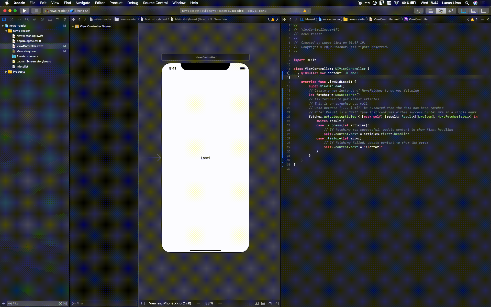

Week 1 - Creation
 - App that synchronously shows a UITableView of fake news articles

Today we're going to create our very own news viewing app! :tada: Don't worry, we'll be guided through each step, and we've pre-written some of the more complicated code so we can get our app up and running in just one session.

Let's get to it! :work:

1. Find Xcode on your machine and launch it
    

1. Create a new project using the option `Single View App`
    

1. Update the following fields:
    1. **Product name:** Something like 'bestest-news-reader'
    1. **Team** Leave this set to 'none'
    1. **Organization Name:** Something like `Codebar`
    1. **Organization Identifier:** Something like `com.codebar`
    1. **Language:** Swift :awesome:
    1. **Use Core Data:** Leave this unchecked
    1. **Include Unit Tests:** Uncheck this
    1. **Include UI Tests:** Uncheck this
    

1. Run the project by hitting the `Play` button up top

    

1. Another application will start - the `Simulator`. This application lets us see how our iOS app looks without needing a physical device. Given that we haven't made any changes, we should see an empty white screen. Amazing - we're now iOS developers!! :heart:

    

1. Now, open up the file `Main.storyboard`. This is the file where we represent the layout of our app. It's a great tool to use because it lets us easily visualise our app.

    

1. A label is used to display non-interactive text. That is, our users can't change the text in this label, but we can. :thumbsup: Create a label in the `Main.storyboard` file and write the word Codebar inside.

    

1. Now run the app again by hitting the play button. We can see our label on the Simulator. We're now mid-level iOS Developers!! :star:

    

1. Next we're going to add some dynamic data to our app. This is typically done by connecting to an API so we can get real time data from the Internet. We'll come back to this network code in a later workshop, but for now_....here's one we prepared earlier!_ Download this file: <Link to DataSource file>

1. Drag the downloaded file `NewsFetching.swift` into the Project Navigator section of your app

    

1. This file contains 2 objects:
    1. **NewsFetcher:** A class for fetching news articles from [newsapi.org](https://newsapi.org/)
    1. **NewsItem:** A struct for holding the fetched news article data

1. In order to update our label, we have to add it to our `ViewController.swift`:

    ```swift
        class ViewController: UIViewController {
    
          @IBOutlet var content: UILabel!
    
          ...
    ```
    
1. Next, since we've included `NewsFetching.swift` in our project, we can now use the `NewsFetcher` to fetch actual data. Add this code to the `viewDidLoad()` method of `ViewController.swift`:

    ```swift
        override func viewDidLoad() {
            super.viewDidLoad()
            // Create a new instance of NewsFetcher to do our fetching
            let fetcher = NewsFetcher()
            // Ask fetcher to get latest articles
            // This is an asynchronous call
            // Code between { ... } will be executed when the data has been fetched
            // Note: Result is a Swift type that captures either success or failure in a single enum
            fetcher.getLatestArticles { [weak self] (result: Result<[NewsItem], NewsFetcherError>) in
                switch result {
                case .success(let articles):
                    // If fetching was successful, update content to show first headline
                    self?.content.text = articles.first?.headline
                case .failure(let error):
                    // If fetching failed, update content to show the error
                    self?.content.text = "\(error)"
                }
            }
        }
    ```
    
1. Now run the app again by hitting the play button. We will need to wait while data is fetched from the server, but then we should see our label updated to show current content. Did it work??

1. Whoops - we forget to connect our label between our source file (`ViewController.swift`) and our storyboard (`Main.storyboard`). Carefully follow the steps here to open the assistant editor and connect the label from the storyboard to the label in code.

    

1. Run the app again by hitting the play button. We will need to wait while data is fetched, but then we should see `content` label being updated to show a real headline. Oops, the text is getting cropped!

    

1. We need to add some constraints to make the label size larger.

    

1. Run the app again by hitting the play button. We will need to wait while data is fetched, but then we should see `content` label being updated to show a real headline. Woohoo!! We're now senior iOS Developers!! :trophy:

    

1. Showing a single headline is a bit dull. Let's make this app truly great and show a whole scrolling table of headlines!! To do this we need a `UITableView` rather than a `UILabel`. A `UITableView` is what we see a lot in iOS apps. It's a scrolling list of repetitive information. In our case, we will show a scrolling list of `NewsItems`.

1. Open `Main.storyboard` and delete the content label you created earlier. Now drag in a UITableView.

    

1. Now we need to change the label declaration to a`UITableView` declaration:

    ```swift
    class ViewController: UIViewController {
        @IBOutlet var tableView: UITableView!
        ...
    ```

1. Don't forget to connect the outlet on the `UITableView` in the Storyboard.

    

1. A `UITableView` needs a `UITableViewDataSource` to tell it what information to show. At minimum, a `UITableViewDataSource` provides this information:
    1. **numberOfSections:** How many sections the table contains (a section is a group of items)
    1. **numberOfRowsInSection:** How many rows the table contains (a row for each `NewsItem`)
    1. **cellForRow:** A visual representation of the `NewsItems`

1. Update `ViewController` so it is able to act as a `UITableViewDataSource` in `ViewController.swift`:

    ```swift
    class ViewController: UIViewController {
        @IBOutlet var tableView: UITableView!
        
        var articles = [NewsItem]()
        
        override func viewDidLoad() {
            super.viewDidLoad()
            // Configure the TableView to reuse cells based on an identifier
            tableView.register(UITableViewCell.self, forCellReuseIdentifier: "ArticleCell")
            
            // Configure the TableView to use our class as the Data Source
            tableView.dataSource = self
            
            // Create a new instance of NewsFetcher to do our fetching
            let fetcher = NewsFetcher()
            // Ask fetcher to get latest articles
            // This is an asynchronous call
            // Code between { ... } will be executed when the data has been fetched
            // Note: Result is a Swift type that captures either success or failure in a single enum
            fetcher.getLatestArticles { [weak self] (result: Result<[NewsItem], NewsFetcherError>) in
                switch result {
                case .success(let newArticles):
                    // If fetching was successful, set the articles variable from ViewController with new articles
                    self?.articles = newArticles
                    
                    // The tell the tableView it should reload its data
                    self?.tableView.reloadData()
                case .failure(let error):
                    // If fetching failed, print the error
                    print(error.localizedDescription)
                }
            }
        }
    }
    
    extension ViewController: UITableViewDataSource {
        func numberOfSections(in tableView: UITableView) -> Int {
            return 1
        }
        
        func tableView(_ tableView: UITableView, numberOfRowsInSection section: Int) -> Int {
            return articles.count
        }
        
        func tableView(_ tableView: UITableView, cellForRowAt indexPath: IndexPath) -> UITableViewCell {
            //// Complete me with cells that show the data from articles
            return UITableViewCell()
        }
    }
    ```
    
1. Run the app by hitting the play button. We will need to wait while data is fetched, then we should see a scrollable table of items. The table is beautiful....but the rows are empty.

    

1. We need to use the data from `articles` to populate each row. This is done by configuring our `UITableViewCells` in the `cellForRow:` method:

    ```swift
    func tableView(_ tableView: UITableView, cellForRowAt indexPath: IndexPath) -> UITableViewCell {
      let cell = tableView.dequeueReusableCell(withIdentifier: "ArticleCell", for: indexPath)
      cell.textLabel?.text = articles[indexPath.row].headline
      return cell
    }
    ```
    
1. Now one more time, hit that play button and run the app. After the data is fetched, we should see a scrollable table of `NewsItems`. :tada:

    

1. The last step is to form a startup and become app billionaires!! :money_mouth_face: :money_mouth_face: :money_mouth_face:
