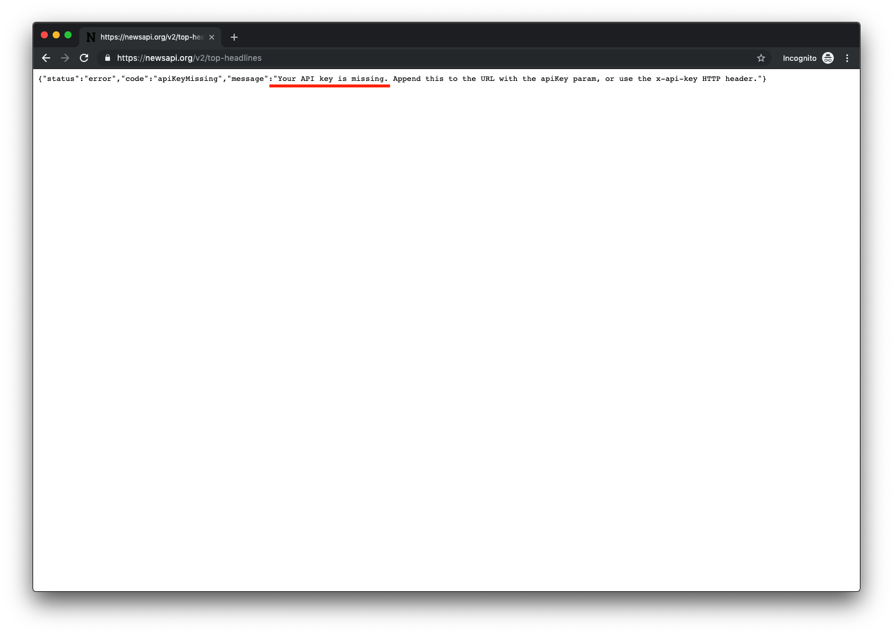

# Week 2 - Networking
Today we are going to make our app _really_ talk to the internet! We are going to add networking functionality and retrieve data from the public `newsapi.org` service.

### Prerequisites:
- Complete the [week 1 tutorial](../Week1/Week1-Creation.md)!

## 1. Using a real API
1. Register a new API key at [newsapi.org](https://newsapi.org/register/). This key gives us permission to download news articles from the API.
    
1. You will be sent an email with your unique API key for accessing this free service that provides news headlines.
1. Part of the conditions of using `newsapi.org` data is that we have to attribute the website in our app. Let's add a header to our table that shows where we are fetching data from.
1. Go to the `Main.storyboard` file and add a `UILabel` to the `UITableViewHeader`
    

1. Configure the label using:
     - Text: `Data from newsapi.org`
     - Color: `White Color`
     - Alignment: `Center`
     - Background: `Light Gray Color`
    
1. Now let's actually download the data from `newsapi.org`. Navigate to `NewsFetching.swift`. Remember this was a stubbed file we dropped in to fetch data from "The Internet".
1. Delete the contents of `func getLatestArticles()`
    ```swift
    class NewsFetcher {
        func getLatestArticles(_ completion: @escaping (Result<[NewsItem], NewsFetcherError>) -> Void) {
        }
    }
    ```
1. Even though _we're_ all perfect programmers, sometimes things can go wrong. It's best practice in iOS to pass errors up to the highest level. We will now add some possible errors to our code above `func getLatestArticles()`:
    ```swift
    enum NewsFetcherError: Error {
        case someError
        case invalidURL
        case invalidData
        case cannotParseData
    }
    ```
1. Now we will use iOS system functionality to download the real articles. For this we need an `NSURL`, an `NSURLSession` and a `dataTask`. And note that you should replace `<YOUR_API_KEY_HERE>` with the key sent to your email from `support@newsapi.org`.
    ```swift
    class NewsFetcher {
        private let session = URLSession.shared

        func getLatestArticles(_ completion: @escaping (Result<[NewsItem], NewsFetcherError>) -> Void) {
          guard let url = URL(string: "https://newsapi.org/v2/top-headlines?q=apple&apiKey=<YOUR_API_KEY_HERE>") else {
                completion(.failure(.invalidURL))
                return
            }

            session.dataTask(with: url) { data, response, error in

            }
        }.resume()
    }
    ```
1. We're fetching the articles from "The Internet" now, but we can't yet see them! Let's dump the data to make sure that `newsapi.org` is really working. And remember our errors? We're going to use some more of them now!
    ```swift
    func getLatestArticles(_ completion: @escaping (Result<[NewsItem], NewsFetcherError>) -> Void) {
        guard let url = URL(string: "https://newsapi.org/v2/top-headlines?q=apple&apiKey=<YOUR_API_KEY_HERE>") else {
            completion(.failure(.invalidURL))
            return
        }

        session.dataTask(with: url) { data, response, error in
            guard error == nil else {
                completion(.failure(.someError))
                return
            }

            guard let data = data else {
                completion(.failure(.invalidData))
                return
            }

            dump(data)
        }.resume()
    }
    ```
1. Run the app to see our data being dumped to the console in Xcode. So exciting!! :star:
    

## 2. Showing downloaded titles
1. We're able to dump the raw data from `newsapi.org`, but the point of our iOS app is to make it pretty!! :rose:  
Now we need to make swift objects that match the data sent from the API. They will need to contain:
    - `status`: whether the API call was successful
    - `totalResults`: number of articles returned
    - `Articles`: the content to display
    ```swift
    struct NewsResponse: Decodable {
        let status: String
        let totalResults: Int
        let articles: [NewsItem]
    }

    struct NewsItem: Decodable {
        let title: String
    }
    ```
1. Now we can update `getLatestArticles` to get our articles.

    ```swift
    func getLatestArticles(_ completion: @escaping (Result<[NewsItem], NewsFetcherError>) -> Void) {
        guard let url = URL(string: "https://newsapi.org/v2/top-headlines?q=apple&apiKey=<YOUR_API_KEY_HERE>") else {
            completion(.failure(.invalidURL))
            return
        }

        session.dataTask(with: url) { data, response, error in
            guard error == nil else {
                completion(.failure(.someError))
                return
            }

            guard let data = data else {
                completion(.failure(.invalidData))
                return
            }

            do {
                let response = try JSONDecoder().decode(NewsResponse.self, from: data)
                let articles = response.articles
                completion(.success(articles))
            } catch {
                completion(.failure(.cannotParseData))
            }
        }.resume()
    }
    ```
1. OK - let's run the app to see our real article titles coming from `newsapi.org`.  
Uh-oh?
    
1. :confused: That didn't work so well.  
Remember in `week1` we talked about completion blocks? The issue here is that we tried to update UI on a **background thread**. Let's fix this by updating our `ViewController` to reload the UI on the **main thread**:
    ```swift
    override func viewDidLoad() {
        ...
        fetcher.getLatestArticles { [weak self] (result: Result<[NewsItem], NewsFetcherError>) in
            switch result {
            case .success(let newArticles):
                // If fetching was successful, set the articles variable from ViewController with new articles
                self?.articles = newArticles

                // Then tell the tableView it should reload its data
                // Remember to call reloadData() from the main thread
                DispatchQueue.main.async {
                    self?.tableView.reloadData()
                }
            case .failure(let error):
                // If fetching failed, print the error
                print(error.localizedDescription)
            }
        }
    }
    ```
1. *Now* let's run the app to see our real articles coming from `newsapi.org`. :tada:
     

1. There are some improvements we can make to our code quality before going further. Let's make our URL creation a bit more flexible:
    ```swift
    class NewsFetcher {
        private let baseURL = "https://newsapi.org"
        private let apiKey = "<YOUR_API_KEY>"
        private let session = URLSession.shared

        func getLatestArticles(_ completion: @escaping (Result<[NewsItem], NewsFetcherError>) -> Void) {
            let endpoint = "/v2/top-headlines"
            let queryParameters = "q=apple&apiKey=\(apiKey)"

            guard let url = URL(string: "\(baseURL)\(endpoint)?\(queryParameters)") else {
                completion(.failure(.invalidURL))
                return
            }
            ...
        }
    }
    ```
1. That code is a little neater. We're not hardcoding values in our url anymore. But we're still using a string. This is what we call `Stringly Typed`. We can do better using `NSURLComponents`:
    ```swift
    func getLatestArticles(_ completion: @escaping (Result<[NewsItem], NewsFetcherError>) -> Void) {
        let endpoint = "/v2/top-headlines"
        let queryParameters = "q=apple&apiKey=\(apiKey)"

        guard let url = createURL(baseURL: baseURL, endpoint: endpoint) else {
            completion(.failure(.invalidURL))
            return
        }
        ...
    }

    private func createURL(baseURL: String, endpoint: String) -> URL? {
        guard let endpointUrl = URL(string: baseURL)?.appendingPathComponent(endpoint) else { return nil }
        guard var urlComponents = URLComponents(url: endpointUrl, resolvingAgainstBaseURL: false) else { return nil }

        return urlComponents.url
    }
    ```
1. Great - let's try out our neater code to check it still works! Run the app please.
1. Uh-oh. We're not getting any data now. :cry: We must have broken something with our new `createURL()` method. How can we check what it's doing? Add a breakpoint just after the `guard` statement in `getLatestArticles()`:
   ```swift
   guard let url = createURL(baseURL: baseURL, endpoint: endpoint) else {   
       completion(.failure(.invalidURL))
       return
   }
   <Add a breakpoint at this line>
   ```
   
1. Now run the app and use `po url` in the `console` panel of Xcode to see what the created URL looks like. Copy the URL and paste it into a browser. The error explains the issue:
    
1. :flushed: We forgot about the URL query parameters, including the `apiKey`. Whoops. Let's add them now:
    ```swift
    func getLatestArticles(_ completion: @escaping (Result<[NewsItem], NewsFetcherError>) -> Void) {
        let endpoint = "/v2/top-headlines"
        let parameters = ["q":"apple"]

        guard let url = createURL(baseURL: baseURL, endpoint: endpoint, parameters: parameters) else {
            completion(.failure(.invalidURL))
            return
        }
        ...
    }

    private func createURL(baseURL: String, endpoint: String, parameters: [String: String]) -> URL? {
        guard let endpointUrl = URL(string: baseURL)?.appendingPathComponent(endpoint) else { return nil }
        guard var urlComponents = URLComponents(url: endpointUrl, resolvingAgainstBaseURL: false) else { return nil }

        urlComponents.queryItems = createQueryItems(parameters: parameters)

        return urlComponents.url
    }

    private func createQueryItems(parameters: [String: String]) -> [URLQueryItem] {
        var queryItems = [URLQueryItem]()

        let apiKeyQueryItems = URLQueryItem(name: "apiKey", value: apiKey)
        queryItems.append(apiKeyQueryItems)

        for (queryKey, queryValue) in parameters {
            let newQueryItem = URLQueryItem(name: queryKey, value: queryValue)
            queryItems.append(newQueryItem)
        }

        return queryItems
    }
    ```
1. OK - let's fire up the app and try that out. Now we have a simple app, and clean, bug-free code. <image showing the app running>


## 3. Interacting with articles
1. Seeing the title of an article is a little bland. Let's also show the associated description. First we need to fetch the description from the backend. This really is as simple as adding a new field to our `NewsItem` struct:
    ```swift
    struct NewsItem: Decodable {
        let title: String
        let description: String
    }
    ```
1. In order to show both the title and the description in our list of articles, we need to customise our `UITableViewCell`. The simplest way to do this is using a prototype cell. Open `Main.storyboard` and add a cell then set its `style` to `subtitle`:

    

1. Since we're using a prototype cell, we no longer need to register our `UITableViewCell` in code. The storyboard does this for us automatically. Nice! So we can remove this code:
    ```swift
    override func viewDidLoad() {
        super.viewDidLoad()
        // We don't need to manually register the reuse identifier for the cell anymore
        // because the Storyboard does that now. So we can just comment or erase the line below!
        tableView.register(UITableViewCell.self, forCellReuseIdentifier: "ArticleCell")
        ...
    }
    ```
1. Let's run the app again and see how it looks: <image of crash...>
1. We screwed up....again. When we were registering the `UITableViewCell` in code, we used a `reuseIdentifier` of "ArticleCell". Now that we're using the storyboard to define our `UITableViewCell`, we also need to define our `reuseIdentifier` there too:
    

1. Let's check that the app works _now_ :sweat:
1. OK, now we need to actually show the `article.description` as our cell subtitle. We'll clean up the code a little as we go. Also remember that setting a `UILabel.numberOfLines = 0` means the label will always grow to fit all the content:
    ```swift
    func tableView(_ tableView: UITableView, cellForRowAt indexPath: IndexPath) -> UITableViewCell {
        let cell = tableView.dequeueReusableCell(withIdentifier: "ArticleCell", for: indexPath)
        let article = articles[indexPath.row]

        cell.textLabel?.text = article.title
        cell.textLabel?.numberOfLines = 0

        cell.detailTextLabel?.text = article.description
        cell.detailTextLabel?.numberOfLines = 0

        return cell
    }
    ```
1. Let's fire up the app and see how it's looking now: <image of app showing article titles AND subtitles>
1. Fantastic - we can now give our users some context for each news article. A fairly standard pattern in iOS is to show a summary list, then let the user choose an item and see more detail. Let's do that by fetching the `url` from `newsapi.org`:
    ```swift
    struct NewsItem: Decodable {
        let title: String
        let description: String
        let url: URL
    }
    ```
1. iOS is easy, huh? :joy: When the user taps on the cell, we are informed by the `delegation` pattern. This effectively means the `UITableView` is saying "Hey! The user interacted with me! Do something about it, NOW!!". We should make our `ViewController` the delegate:
    ```swift
    override func viewDidLoad() {
        super.viewDidLoad()
        // Configure the TableView to use our class as the Delegate
        tableView.delegate = self
        // Configure the TableView to use our class as the Data Source
        tableView.dataSource = self
        ...
   }

    ```
1. The compiler complains now because `ViewController` does not currently know how to be a `UITableViewDelegate`. Let's show it how:
    ```swift
    extension ViewController: UITableViewDelegate {
        func tableView(_ tableView: UITableView, didSelectRowAt indexPath: IndexPath) {
            // Get the selected article using the tapped row
            let selectedArticle = articles[indexPath.row]
            print("Selected \(selectedArticle.title)")
        }
    }
    ```
1. Run the app and you will see that when you tap on a cell (ie click with the mouse), the log shows you which cell was tapped. :ok:
1. The final step is to show the article at the `url` we downloaded above. To do this we can use an `SFSafariViewController`. This class is effectively a mini web browser we can use in our app to show web content.
    ```swift
    extension ViewController: UITableViewDelegate {
        func tableView(_ tableView: UITableView, didSelectRowAt indexPath: IndexPath) {
            // Get the selected article using the tapped row
            let selectedArticle = articles[indexPath.row]

            // Create a new screen for loading Web Content using SFSafariViewController
            let articleViewController = SFSafariViewController(url: selectedArticle.url)
        }
    }
    ```
1. Run the app and let's see what happens now when we tap a cell.
1. Nothing. :\_( The issue is that we're creating the SFSafariWebViewController, but we're not displaying it. In order to display it, we need to first embed our `ViewController` into a `UINavigationController`. This is not a screen itself, but a container for other screens. It gives us functionality like drilling down into detail, then tapping the back button to go back to the summary. With storyboards, it's easy:

    

1. Let's also set a title for the `ViewController` so the user knows where they are within the app:
    ```swift
    override func viewDidLoad() {
            super.viewDidLoad()
            // Sets a title the current screen
            title = "News Fetcher"
            ...
    }
    ```
1. If we run the app now, we can see that there's a navigation bar at the top of the screen containing "News Fetcher". <image of app with navigation bar>
1. Now comes the final step - showing the `SFSafariViewController` when the user taps on a cell. We do this by asking the navigationController (this is the `UINavigationController` we added in the storyboard) to present the new screen:
    ```swift
    extension ViewController: UITableViewDelegate {
        func tableView(_ tableView: UITableView, didSelectRowAt indexPath: IndexPath) {
            // Get the selected article using the tapped row
            let selectedArticle = articles[indexPath.row]

            // Create a new screen for loading Web Content using SFSafariViewController
            let articleViewController = SFSafariViewController(url: selectedArticle.url)

            // Present the screen on the Navigation Controller
            navigationController?.present(articleViewController, animated: true, completion: nil)
        }
    }
    ```
1. Run the app and tap on one of the cells. Notice how we get the back button without doing any customisation? This is nice. <image of web view detail screen>
1. All done - please pat yourself on the back before closing your laptop. :bow:
