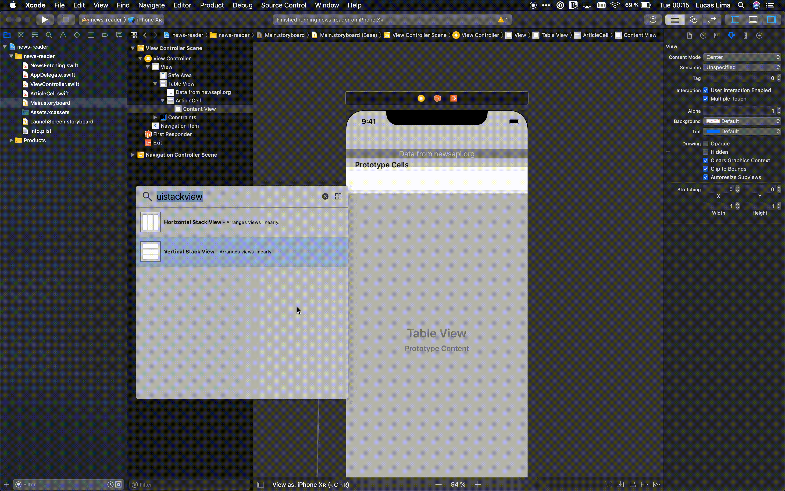

# Workshop 3 - Beautiful
Today we are going to make our app _beautiful_. Fetching data from the internet is only the first step toward making a successful app. We need to make sure our app is pleasing to look at - that's what we'll be focussing on today by adding images.

### Prerequisites:
- Complete the [workshop 1 tutorial](../Workshop1/Workshop1-Creation.md)
- Complete the [workshop 2 tutorial](../Workshop2/Workshop2-Networking.md)

## 1. Alternating row colors
1. Remember that our cell is defined as a `Prototype Cell` in our `Main.storyboard`. This is the quickest way to add a `UITableViewCell` into a table and we are going to use it to customize our cell.

1. In order to customize our cell, let's pull it out of the storyboard into it's own file. First, create a new `Cocoa Touch Class`:

    

1. Name the file `ArticleCell`, make it a Subclass of `UITableViewCell`. Make sure to disable the checkbox to `Also create XIB file`.

    

1. Tap `next` and pick then `Create`. Make sure the `news-reader` checkbox is checked under `Targets`.

    

1. Now we have the new file added to our project - `ArticleCell.swift`

    

1. The next step is to configure our prototype cell in Storyboard to use the newly added `ArticleCell` class. Open the storyboard file and select our prototype cell.
    
    

1. All we need to do now is set the `Class` under the `Custom Clss` section. Tap on the `Identity Inspector` button and type `ArticleCell` under `Class`.

    

1. Now we can fire up the app and see our custom cell!

    

1. Let's try alternating the cell backgrounds so we can more easily tell them apart. We do this by setting the `backgroundColor` depending on `indexPath.row`:


    ```swift
    func tableView(_ tableView: UITableView, cellForRowAt indexPath: IndexPath) -> UITableViewCell {
        ...        
        cell.detailTextLabel?.text = article.description
        cell.detailTextLabel?.numberOfLines = 0
        
        // Divide the row's index by 2 and if there's a remainder of 1, we have an odd index
        if indexPath.row % 2 == 1 {
            cell.backgroundColor = UIColor(white: 0.95, alpha: 1.0)
        }
        
        return cell
    }
    ```

1. Run the app and scroll up and down. What is going on _now_?

    

1. This issue appears because of cell reuse. Recall in `workshop 1` we explained how `UITableViewCells` are reused for memory efficiency. In this case, our light gray cell is being reused, so we need to ensure that we reset it each time it's reused. Luckily, there's a method for that in `UITableViewCell`:

    ```swift
    class ArticleCell: UITableViewCell {
        ...
        override func prepareForReuse() {
            backgroundColor = .white
        }
    }
    ```

1. Now run the app and marvel at our custom `ArticleCell` with alternating background colors. :tada:

    


## 2. Adding an Image

1. Let's start by adding an image to each cell. Eventually we'll fetch an appropriate image from `newsapi.org`, but for now a static image will do.

1. Download [placeholder-image.png](./placeholder-image.pdf) to your computer. We use this format as pdfs can be scaled without losing quality. Note that iOS doesn't actually render these images as pdf, Xcode converts them to png first.

1. Now open the `Assets.xcassets` folder in Xcode and drop the image into the large gray area:

    

1. The next part is tricky. In order to add a `UIImageView` to our custom `ArticleCell`, we need to change it's type from `Subtitle` to `Custom`. First go to the `Main.storyboard`. Select the `ArticleCell` and tap on the `Attributes Inspector` button. Then, change the cell style from `Subtitle` to `Custom`.

    

1. But when we do this, we lose our `Title` and `Subtitle` labels!! :frowning_face:

1. This means we need to recreate our view piece by piece. Let's do this by adding a vertical `UIStackView` filling our entire cell:

    

1. Next we can re-add title and subtitle `UIlabels` to the stack view. The `UIStackView` takes care of all our layout automatically! :grinning:

    

1. Note that Xcode notifies us that there is an issue with our layout. Let's make Xcode fix this for us.
    
    

1. Xcode changed the `Content hugging priority` of the first Label to a value of `250`. Setting this value indicates that the first label may grow larger than its content. Those properties are necessary so Auto Layout can correctly calculate the size of our components based on the content they host.

1. Run the app to see how things look using a UIStackView.

    

1. We're not quite there yet. We forgot to hook up our new labels as `IBOutlets`. We can also override the methods that return `textLabel` & `detailTextLabel` so that we don't need to change the code in `ViewController`. :cool:

    ```swift
    class ArticleCell: UITableViewCell {

        @IBOutlet weak var articleTitle: UILabel!
        @IBOutlet weak var articleDescription: UILabel!
    
        override var textLabel: UILabel? {
            return articleTitle
        }
    
        override var detailTextLabel: UILabel? {
            return articleDescription
        }
    
        override func prepareForReuse() {
            backgroundColor = .white
        }
        ...
    }
    ```

1. Let's run the app and see how it looks now!

    

1. See how white space can really affect the look of an app? We can tweak a few fields on the `UIStackView` inside `ArticleCell.xib` to give it more white space:
    - Set `Spacing` property to `5`
    - Set the `Trailing` & `Leading` constraint constants to `15`
    - Set the `Bottom` & `Top` constraint constants to `8`

      

1. Let's check how that looks:

    

1. Now let's add a `UIImageView` to the stack view between `title` and `subtitle`. Ensure the UIImageView is configured as:
    - Set `Image` property to `placeholder-image`
    - Set `Content Mode` to `Aspect Fill`

    
    
1. How is this looking in the simulator?

    
    
1. We're showing the image, but it doesn't look _beautiful_. Let's make it smaller so it fits more evenly with the text. Add a `Height` constraint with a constant vaue of `100`.

    

1. It's also easy to round the corners of our image, so let's do that for a more polished look. First we need to connect the image to an `IBOutet` in `ArticleCell.swift`.

1. Next we set the `cornerRadius` property on the view's `layer`:


    ```swift
    class ArticleCell: UITableViewCell {

        @IBOutlet weak var articleTitle: UILabel!
        @IBOutlet weak var articleImage: UIImageView! {
            didSet {
                articleImage.layer.cornerRadius = 12.0
            }
        }
        @IBOutlet weak var articleDescription: UILabel!
        ...
    }
    ```

1. Run the app now to see each article with our beautiful placeholder image!!

    

## 3. Downloading an Image

1. Showing a placeholder image is a good start, but now let's download the image associated with each article from the `newsapi.org`. Like we did in `workshop 2`, we need to add the name of the field exactly as per the api. Here's a snippet from the `https://newsapi.org/` home page:

   ```json
   {
        "status": "ok",
        "totalResults": 1053,
        "articles": [
            {
                ...
                "title": "Where does the Apple Watch go next?",
                "description": "Apple is widely expected to announce the latest iteration of the Apple Watch at its upcoming iPhone event.",
                "url": "https://www.theverge.com/applewatch.html",
                "urlToImage": "https://cdn.vox-cdn.com/thumbor/apple-watch.jpg",
                "publishedAt": "2019-09-08T14:00:00Z",
                ...
            }
        ]
        ...
    }
   ```

1. Add the field `urlToImage` to our `NewsItem` in `NewsFetching.swift`. We make it optional just in case `newsapi.org` returns a `null` URL (unfortunately this is possible):
    
    ```swift
    struct NewsItem: Decodable {
        let title: String
        let description: String
        let url: URL
        let urlToImage: URL?
    }
    ```
    
1. Before we go further, let's modify our code so that we navigate to the article image when we tap on a cell:

    ```swift
    extension ViewController: UITableViewDelegate {
        func tableView(_ tableView: UITableView, didSelectRowAt indexPath: IndexPath) {
            ...
            // Create a new screen for loading Web Content using SFSafariViewController
            // Temporarily change this to urlToImage to test that URL is being parsed correctly
            let articleViewController = SFSafariViewController(url: selectedArticle.urlToImage)
        ...
        }
    }
    ```

1. Run the app and check that when you tap on a cell, you see the article's image!

1. Now revert the `UITableViewDelegate` to again load `url` instead of `urlToImage`. (and remove the corresponding comment!)

    ```swift
    extension ViewController: UITableViewDelegate {
        func tableView(_ tableView: UITableView, didSelectRowAt indexPath: IndexPath) {
            ...
            // Create a new screen for loading Web Content using SFSafariViewController
            let articleViewController = SFSafariViewController(url: selectedArticle.url)
        ...
        }
    }
    ```

1. Good, we're successfully fetching the URL of the image associated with each news article. Next we need to download it asynchronously and place it in our `UIImageView`. In order to do this, download [ImageDownloading.swift](./ImageDownloading.swift) and drag it into your Xcode project.

1. `ImageDownloading.swift` contains a simple class for downloading an image for a given `URL`. It's quite similar to `NewsFetcher`, so feel free to have a look after the workshop.

1. Now we need to add a function to `ArticleCell` that will load an image for us:

    ```swift
    func loadImage(at url: URL) {
        ImageDownloader().downloadImage(url: url) { result in
            switch result {
            case .success(let image):
                DispatchQueue.main.async {
                    self.articleImage.image = image
                }
            case .failure(let error):
                print(error)
            }
        }
    }

    ```
    
1. Now we have all the pieces, it's simple to update our `UITableViewDataSource` inside `ViewController.swift`:

    ```swift
    func tableView(_ tableView: UITableView, cellForRowAt indexPath: IndexPath) -> UITableViewCell {
        // This always fetches a cell of type UITableViewCell, even if we are using a custom subclass
        let cell = tableView.dequeueReusableCell(withIdentifier: "ArticleCell", for: indexPath)
        ...        
        if indexPath.row % 2 == 1 {
            cell.backgroundColor = UIColor(white: 0.95, alpha: 1.0)
        }
        
        // We need to ensure that we actually have a cell of type ArticleCell
        guard let articleCell = cell as? ArticleCell else {
            return cell
        }
        
        if let imageUrl = article.urlToImage {
            articleCell.loadImage(at: imageUrl)
        }
        
        return articleCell
    }
    ```

1. Note that we have to unwrap our cell as an `ArticleCell`. This is possible because `ArticleCell` subclasses `UITableViewCell`. That is, we can treat cell as a `UITableViewCell` _or_ an `ArticleCell`. Since `tableView.dequeueReusableCell()` always returns the superclass `UITableViewCell`, we need to use a `guard unwrap` to get a strongly typed `ArticleCell`.

1. Run the app in the simulator and watch as the images appear! Now quickly scroll up and down, then stop. What is going on? The images are flickering! :anguished:

    


1. The issue here, once again, is cell reuse. We're recycling existing cells that already have an image. So rather than seeing the placeholder for a recycled cell, we see the last image that was downloaded. There is an easy fix for this in `ArticleCell.swift`:

    ```swift
    override func prepareForReuse() {
        backgroundColor = .white
        articleImage.image = UIImage(named: "placeholder-image")
    }
    ```

1. Let's try again. Launch the app again and slowly scroll up and down. Now we see the placeholder when an image is being downloaded. What happens if we scroll quickly again? There are _still_ flickering images! :sob:

    

1. Now we're dealing with an even trickier issue. This behaviour is because of our asynchronous downloading. What's actually happening is:
    1. `Cell A` is shown at `position 0` with placeholder image
    1. `Cell A` requests to start downloading `image 0`
    1. User quickly scrolls down so that `Cell A` is now being reused at `position 15`
    1. `Cell A` is shown at `position 15` with placeholder image
    1. `Cell A` start downloading `image 15`
    1. Download of `image 0` completes, so `Cell A` is updated with `image 0`
    1. User briefly sees `image 0` alongside `article 15` :x:
    1. Download of `image 15` completes, so `Cell A` is updated with `image 15`
    1. User now sees `image 15` alongside `article 15` :white_check_mark:

1. The solution now is to ensure that we cancel any image downloads when we reuse a cell. In order to do this we need to save any image download task, and cancel it during `prepareForReuse()`:

    ```swift
    class ArticleCell: UITableViewCell { 
       ...
        var imageDownloadTask: URLSessionDataTask?
    
        override func prepareForReuse() {
            backgroundColor = .white
            articleImage.image = UIImage(named: "placeholder-image")
            imageDownloadTask?.cancel()
        }
        ...
    }
    ```

1. Start the app and try again! Is it fixed now?

1. Oops. No. We forgot to save the `imageDownloadTask` in our `loadImage` function inside `ArticleCell`:

    ```swift
    func loadImage(at url: URL) {
        imageDownloadTask = ImageDownloader().downloadImage(url: url) { result in
            switch result {
            case .success(let image):
                DispatchQueue.main.async {
                    self.articleImage.image = image
                }
            case .failure(let error):
                print(error)
            }
        }
    }
    ```

1. Let's run the app again. Isn't it beautiful? :relaxed: It's getting there. Next workshop we'll make it **delightful**!!

    