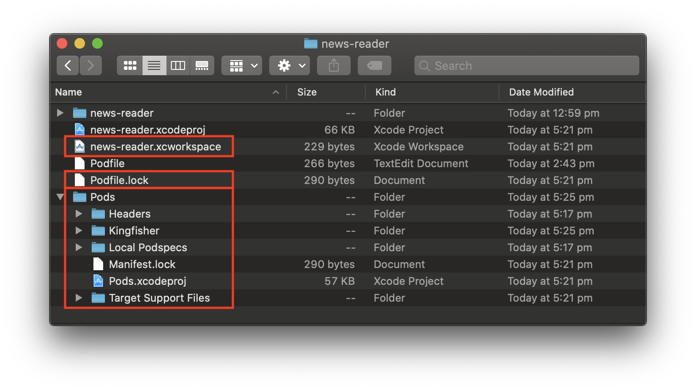
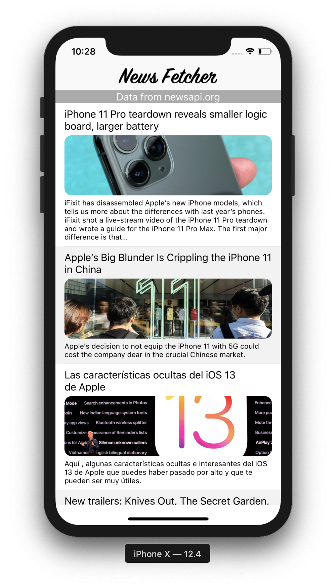
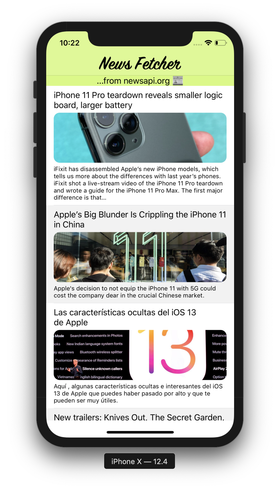
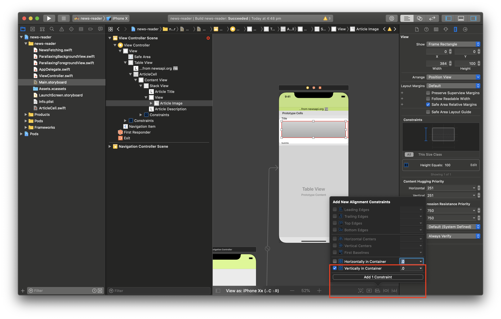

# Workshop 4 - Delight

Last workshop we focussed on making our app more visually appealing with images. Today we are going to polish things up and add some touches of _delight_. When we talk about _delight_, we mean nice flourishes or interactions that just _feel_ nice to our users. When you scroll a lot of text on an iPhone and you reach the end, it bounces back into place. This is a great example of _delight_.

### Prerequisites:
- Complete the [workshop 1 tutorial](../Workshop1/Workshop1-Creation.md)
- Complete the [workshop 2 tutorial](../Workshop2/Workshop2-Networking.md)
- Complete the [workshop 3 tutorial](../Workshop3/Workshop3-Beautiful.md)
- Admin access to your laptop
    - Type `sudo date` in the `Terminal` app
    - You will be prompted for a password
    - Enter your Mac's current user password
    - If you see a date like `Sat 21 Sep 2019 13:55:40 CEST`, you have Admin access :check:
    - If you see something like `<user> is not in the sudoers file. This incident will be reported.` try logging into a different user account on your Mac

## 1. Better image downloading
1. Let's start by improving our image downloading. Last workshop we used the file `ImageDownloading.swift` to download our images. We used a placeholder image that shows while an image is downloading, or when an image fails to load:

    

1. This works, but has some fairly basic flaws:
    - User doesn't know whether the image is currently downloading, or whether the image failed to load
    - We redownload the image every time the user scrolls

1. Rather than add a whole lot of functionality to `ImageDownloading.swift`, let's consider using an existing library instead.

1. As in most development environments, iOS has multiple package managers that can be used to quickly add 3rd party (not written by Apple) libraries (also known as packages) to our app.
    - [CocoaPods](https://www.cocoapods.org) is one of the most popular package manager used in the iOS community. CocoaPods refers to libraries as `Pods` and most iOS libraries on GitHub have CocaoPod support.
    - In 2019 Apple released the [Swift Package Manager](https://github.com/apple/swift-package-manager). Swift Package Manager is owned by Apple which is an important consideration for iOS. Apple can and does break functionality required by 3rd party tools from time to time. Swift Package Manager is still quite new, so the number of packages available does not yet match CocoaPods

1. We're going to add the Pod `Kingfisher` to our app using CocoaPods.

1. First we need to install the CocoaPods tool as a [ruby gem](https://guides.rubygems.org/what-is-a-gem/). Type the command `sudo gem install cocoapods` in the Terminal app. The Terminal will ask for a user password, then start downloading and installing lot of files. This should look similar to: (it's OK if the version numbers or specific gems installed are different)

    ```
    Last login: Sat Sep 21 14:26:47 on ttys001
    user@MacBook-Pro ~ % sudo gem install cocoapods
    Password:
    Fetching thread_safe-0.3.6.gem
    …
    Fetching cocoapods-1.7.5.gem
    Successfully installed thread_safe-0.3.6
    …
    Successfully installed cocoapods-1.7.5
    Parsing documentation for thread_safe-0.3.6
    Installing ri documentation for thread_safe-0.3.6
    …
    Parsing documentation for cocoapods-1.7.5
    Installing ri documentation for cocoapods-1.7.5
    Done installing documentation for thread_safe, tzinfo, concurrent-ruby, i18n, activesupport, nap, fuzzy_match, cocoapods-core, claide, cocoapods-deintegrate, cocoapods-downloader, cocoapods-plugins, cocoapods-search, cocoapods-stats, netrc, cocoapods-trunk, cocoapods-try, molinillo, atomos, colored2, nanaimo, xcodeproj, escape, fourflusher, gh_inspector, ruby-macho, cocoapods after 16 seconds
    27 gems installed
    ```

1. To ensure that installation was successful, type the command `which pod` in Terminal and ensure that the ruby gem `pod` now exists at `/usr/local/bin/pod`:

    ```
    user@MacBook-Pro ~ % which pod
    /usr/local/bin/pod
    ```

1. Now we can add CocoaPod support to our app. Navigate to the `news-reader` directory that contains `news-reader.xcodeproj` and type `pod init`. This will create a file named `Podfile`:

    ```
    user@MacBook-Pro ~ % cd /Users/user/Desktop/NewsFetcherWorkshops/Workshop4/news-reader
    user@MacBook-Pro news-reader % ls
    news-reader		news-reader.xcodeproj
    user@MacBook-Pro news-reader % pod init
    user@MacBook-Pro news-reader %  ls
    Podfile			news-reader		news-reader.xcodeproj
    user@MacBook-Pro news-reader %

    ```

1. Open the new file `Podfile` and edit to add Kingfisher as a dependency:

    ```
    # Uncomment the next line to define a global platform for     your project
    # platform :ios, '9.0'

    target 'news-reader' do
      # Comment the next line if you don't want to use dynamic     frameworks
      use_frameworks!

      # Pods for news-reader
      pod 'Kingfisher', '~> 5.7'
    end
    ```

1. We need another command `pod install` to enable CocoaPods within our app:

    ```
    user@MacBook-Pro ~ % pod install
    Analyzing dependencies
    Downloading dependencies
    Installing Kingfisher (5.7.1)
    Generating Pods project
    Integrating client project

    [!] Please close any current Xcode sessions and use `news-reader.xcworkspace` for this project from now on.
    Sending stats
    Pod installation complete! There is 1 dependency from the Podfile and 1 total pod installed.
    ```
If this step fails, try running `pod repo update` first. This ensures that the `pod` tool installed on our computer knows about the latest version of each library.

1. After running `pod install`, our news-reader folder should now have the following additions:

    - **news-reader.xcworkspace** which bundles our `news-reader` project together with our new `Pods` project
    - **Podfile.lock** which tells CocoaPods what version of each `Pod` we're using
    - **Pods folder** which contains a `Pods` project that builds each `Pod` we're using

    

1. As explained by the output of `pod install`, we now load our project by opening `news-reader.xcworkspace`. An `xcworkspace` allows us to create a group of `xcprojects` which depend on each other.

1. Our project looks a little different in Xcode now:

     - `news-reader` project contains all of our original code
     - `Pods` project contains the code for the Kingfisher library

    

     - Tip: The Kingfisher code should be considered read only. If we wanted to change how Kingfisher worked, we would need to create a fork of Kingfisher on Github, make our changes in the fork, and then point our `Podfile` to that fork.  

1. We've successfully added Kingfisher to our project. Time to use it! From Xcode, delete `ImageDownloading.swift`. Xcode asks whether you want to `Remove Reference` or `Move to Trash`. Choose `Move to Trash` then smile to yourself. Deleting code should _always_ feel good. :joy:

1. Now when we compile, `ArticleCell` complains that `ImageDownloader` cannot be found. Let's change `ArticleCell` to use Kingfisher instead!

    ```swift
    import UIKit
    import Kingfisher

    class ArticleCell: UITableViewCell {
        ...
    }

    extension ArticleCell {
        func loadImage(at url: URL) {

            articleImage.kf.setImage(
                with: url,
                placeholder: UIImage(named: "placeholder-image"),
                options: [])
            { result in
                if case let .failure(error) = result  {
                    print(error)
                }
            }
        }
    }
    ```

1. Let's run the app and see how things look now with Kingfisher!

    

1. They look....exactly the same! But now we can add a little flair with virtually no effort:

    ```swift    
    extension ArticleCell {
        func loadImage(at url: URL) {

            // Show an indicator while image is being fetched
            articleImage.kf.indicatorType = .activity
            articleImage.kf.setImage(
                with: url,
                placeholder: UIImage(named: "placeholder-image"),
                options: [
                    // Fade image in so it's delightful!
                    .transition(.fade(1))
                    // Remove comment below to disable automatic image caching
                    // .cacheMemoryOnly, .memoryCacheExpiration(.expired)
                ])
            { result in
                if case let .failure(error) = result  {
                    print(error)
                }
            }
        }
    }
    ```
1. Run the app again to check out our new loading indicator and fade animation provided effortlessly by Kingfisher:

    

1. There's one thing last to note here. What happens when we scroll up and down? After loading once, each image loads **instantly** the second time. Kingfisher enables caching automatically. Here's an example of what the app looks like when caching is disabled:

    

1. It's clear that Kingfisher gives us a lot of delight for very few lines of code. This example shows the joys of using 3rd party libraries. However there are risks too. The owners of Kingfisher could change it's functionality at any time and a simple `pod install` inside Terminal would pull those changes into our app.

    :warning: **It's important to write lots of regression tests when
               using 3rd party libraries!!!** :warning:

## 2. Customize the Navigation Bar

1. Now let's make our navigation bar more appealing. Right now it's quite plain, but we can customize it relatively easily.

    

1. Start by adding the image [navigation-bar-title](./navigation-bar-title.pdf) to the `Assets.xcassets` folder in Xcode. Once added, drag the image from the `1x` space to the `2x` space. This is because our image is provided at double size.

    

1. Now that we've added a cool navigation bar title image, we need to use it as our navigation bar's title. This is done inside `ViewController`:

    ```swift
    class ViewController: UIViewController {
        @IBOutlet var tableView: UITableView!

        var articles = [NewsItem]()

        func customizeNavigationBar() {
            // Replace the default title with a custom image
            navigationItem.titleView = UIImageView(image: UIImage(named: "navigation-bar-title"))
        }

        override func viewDidLoad() {
            super.viewDidLoad()
            // Customize the navigation bar title
            customizeNavigationBar()

            // Configure the TableView to use our class as the Delegate
            tableView.delegate = self
            ...
        }
        ...
    }

    ```
1. Let's run the app and see how that looks! Great - now our app has some brand identity. When users open our app and see our custom "News Fetcher" title, they know they're in the right place.

    

1. Another simple change to help give our app a unique identity is to color the navigation bar. Open `Main.storyboard` and select the `Navigation Bar` element inside the `Navigation Controller Scene`.

1. Select `Bar Tint` from the properties and choose `custom...` which will show Apple's detailed color picking window. The 4th tab `Pencils` makes it easy to choose a color.

    

1. Run the app again and see that our navigation bar now has a unique background color.

1. Now that we've made our navigation bar delightful, the "Data from newsapi.org" header is looking a bit bland. Tap on the label in `Main.storyboard`and update:
    - **Background** to match our navigation bar
    - **Text** to something more fun like "_...from newsapi.org :newspaper:_"

1. Let's run our app and check how that looks...

    

1. Perfect - our app is starting to look like something polished that could ship on the App Store!

## 3. The Parallax Effect

1. OK, so far we've made our app more polished. Now let's add some animation that will delight our users **so much** they will need to lie down.

1. The parallax effect can be very subtle, but it just.... _feels so good_. What is the parallax effect? Broadly speaking it is when two images (a background and a foreground) move in the same direction, but at different speeds. In our app, the background will be our scrolling table view, and the foreground will be the image in each table view cell. Similar to this example:

    

1. In the example above we can see that the foreground and background both move, but at different rates. In the time that background scrolls through `781.7` points, foreground animates `179.6` points:
    ```
    background.minimum = +000.0
    background.maximum = +781.7
    foreground.minimum = -89.8
    foreground.maximum = +89.8
    ```

1. Parallax animations could warrant a workshop series of their own, so we'll use some template code that does the heavy lifting for us. Check out the parallax demo later ([parallax-demo.xccodeproject](./parallax-demo/parallax-demo.xccodeproject)) for a detailed implementation.

1. We can start by adding these two files to our Xcode project:
    1. [ParallaxingBackgroundView.swift](./ParallaxingBackgroundView.swift)
    1. [ParallaxingForegroundView.swift](./ParallaxingForegroundView.swift)

    

1. These files provide the interfaces necessary to make parallax work. Let's start by making ArticleCell implement ParallaxingForegroundView:

    ```swift
    class ArticleCell: UITableViewCell {
        ...
    }

    extension ArticleCell: ParallaxingForegroundView {
    }

    extension ArticleCell {
        func loadImage(at url: URL) {
            ...
        }
    }
    ```

1. Build the app again. The compiler complains that we haven't implemented the ParallaxingForegroundView protocol, so let's do that.  
_Hint: Tap on the red circle at the left of the compilation error and hit the `Fix` button that appears._

    ```swift
    extension ArticleCell: ParallaxingForegroundView {
        var foregroundValueRange: CGFloat {
            // Range of values from minimum parallax to maximum parallax
            // If we choose 100.0:
            //  - at minimum parallax, image will be 50.0 points higher than normal
            //  - at maximum parallax, image will be 50.0 points lower than normal
            return 100.0
        }

        func applyParallax(normalizedValue: CGFloat) {
              let parallaxOffset = foregroundValue(normalizedValue: normalizedValue)
              // We need a way to move image up and down by parallaxOffset
        }
    }
    ```

1. We've satisfied the compiler, but we need to do something with `parallaxOffset` when the `applyParallax` function is called. The easiest way to shift a view up and down is to center it in a container and then add an offset. Let's do that. Start by embedding ArticleCell's image inside another `UIView`:

    

1. Xcode may show an error with our layout, but we will fix that now. As mentioned before, we want to ensure that the UIImageView is vertically centered inside it's container.

    

1. We're going to move our UIImageView up and down to create the parallax effect; at minimum we'll be seeing the upper half and at maximum we'll be seeing the lower half. In order to show only a portion of the UIImageView, we should constrain it to be twice as big as the container view:

    

1.  The layout is still not complete as Xcode doesn't know how wide to make our UIImageView. Add two more constraints:
    - `Trailing Space == Superview Trailing Space`
    - `Leading Space == Superview Leading Space`

1. Let's fire up our app and see if everything looks normal!

    

1. Not quite. We forgot to tell the container view to crop our image. We also need to make sure the edges are still rounded. Inside `ArticleCell`, create a new `@IBOutlet` named `imageContainer` and move the corner rounding from `articeImage` to `imageContainer`. Don't forget to connect the new `@IBOutlet` to the `Main.storyboard`!

    ```swift
    class ArticleCell: UITableViewCell {

        @IBOutlet weak var articleTitle: UILabel!
        @IBOutlet weak var imageContainer: UIView! {
            didSet {
                imageContainer.layer.cornerRadius = 12.0
                imageContainer.layer.masksToBounds = true
            }
        }
        @IBOutlet weak var articleImage: UIImageView!
        @IBOutlet weak var articleDescription: UILabel!
            ...
    }
    ```

1. Run the app again to check how it looks:

    

1. We're getting close! We have an image that is double height contained inside another view. In order to adjust the position of the image for parallax we need to be able to update the `Align Center Y to: Superview` constraint. Luckily, it's easy to create an `@IBOutlet` for a constraint too!

    

1. Now we can complete the parallax code for our Foreground view:

    ```swift
    func applyParallax(normalizedValue: CGFloat) {
          let parallaxOffset = foregroundValue(normalizedValue: normalizedValue)
          // Shift the center constraint up or down by parallaxOffset
          imageCenterYConstraint.constant = parallaxOffset
    }
    ```
